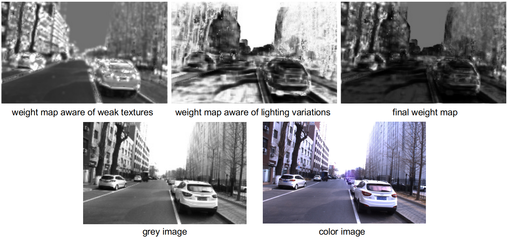
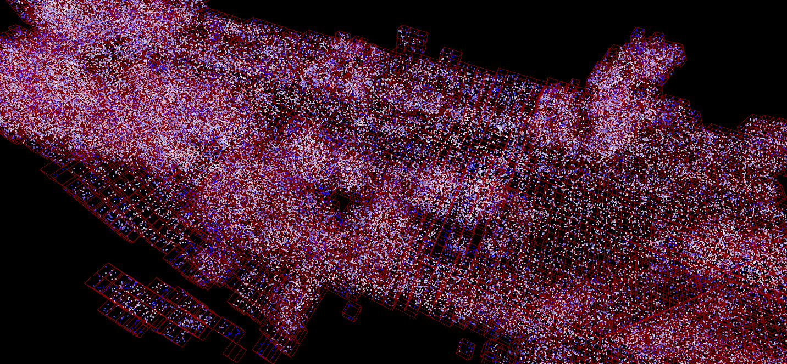

# StreetRecon

**Accurate and Complete Neural Implicit Surface Reconstruction in Street Scenes Using Images and LiDAR Point Clouds**
<br>Chenhui Shi, Fulin Tang,Yihong Wu, Hongtu Ji, Hongjie Duan<br>


Abstract: *Surface reconstruction in street scenes is a critical task in computer vision and photogrammetry, with images and LiDAR point clouds being commonly used data sources. Effectively integrating these two modalities to leverage their complementary strengths remains an open problem. Inspired by recent advances in neural implicit representations, we propose a novel street-level neural implicit surface reconstruction approach that incorporates images and LiDAR point clouds into a unified framework for joint optimization. Three key components make our approach achieve state-of-the-art reconstruction performance with high accuracy and completeness in street scenes. (1) We introduce **an adaptive photometric constraint weighting method** to mitigate the impacts of lighting variations and weak textures on reconstruction. (2) **A new B-spline-based hierarchical hash encoder** is proposed to ensure the continuity of gradient-derived normals and further to reduce the noise from images and LiDAR point clouds. (3) We implement **effective signed distance field (SDF) constraints in a spatial hash grid** allocated in near-surface space to fully exploit the geometric information provided by LiDAR point clouds.*

Our dataset is available at [here](https://doi.org/10.57760/sciencedb.ai.00005).

## Introduce

This repository provides three core modules of our whole project: 
- The adaptive photometric constraint weighting method in `modules/adaptive_weight`;
- The B-spline-based hierarchical hash encoder in `modules/B_spline_hash_encoder`;
- SDF label computing within the spatial hash grid in `modules/udf_in_svh`.
  
In each module, we provide some demos to present how to use the module.

## Install & Run

Run adaptive weighting demo:

```bash
cd modules/adaptive_weight
python adaptivate_weight.py
```

The weight maps are visualized as follows:


Run B-spline-based hierarchical hash encoder demo:

```bash
cd modules/B_spline_hash_encoder/CUDA
python setup.py install
cd ..
python hash_encoder.py
```

Run SDF label computing demo (CUDA-11.8 is needed):
```bash
cd modules/udf_in_svh
# build spatial hash voxel 
python spatial_hash_grid.py
# compute the distances from the sampled points in the saptial hash voxel to the scene point cloud
python udf_in_svh.py
```

The weight maps are visualized as follows:

