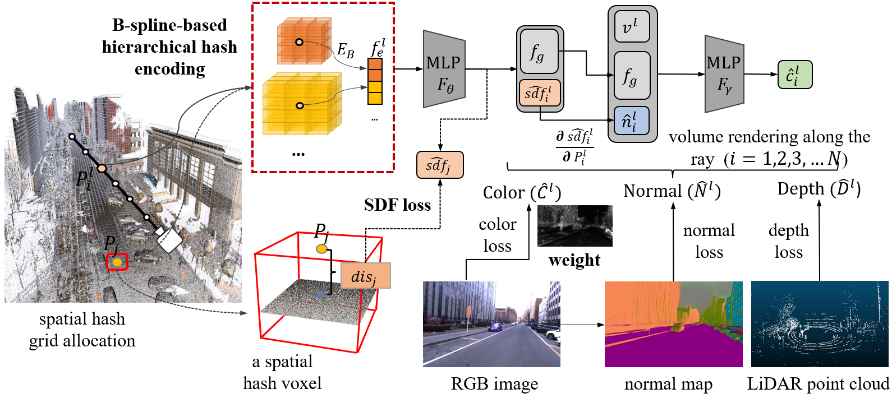

# StreetRecon

**Accurate and Complete Neural Implicit Surface Reconstruction in Street Scenes Using Images and LiDAR Point Clouds**
 Chenhui Shi, Fulin Tang,Yihong Wu, Hongtu Ji, Hongjie Duan 

Abstract: *We present a novel method for reconstructing a 3D implicit surface from a large-scale, sparse, and noisy point cloud. 
Our approach builds upon the recently introduced [Neural Kernel Fields (NKF)](https://nv-tlabs.github.io/nkf/) representation. 
It enjoys similar generalization capabilities to NKF, while simultaneously addressing its main limitations: 
(a) We can scale to large scenes through compactly supported kernel functions, which enable the use of memory-efficient sparse linear solvers. 
(b) We are robust to noise, through a gradient fitting solve. 
(c) We minimize training requirements, enabling us to learn from any dataset of dense oriented points, and even mix training data consisting of objects and scenes at different scales. 
Our method is capable of reconstructing millions of points in a few seconds, and handling very large scenes in an out-of-core fashion. 
We achieve state-of-the-art results on reconstruction benchmarks consisting of single objects, indoor scenes, and outdoor scenes.*
